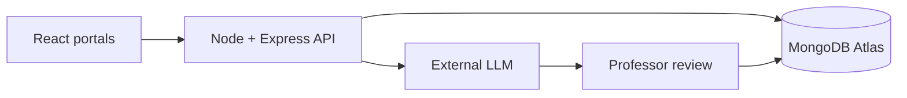

# CampusGrade

CampusGrade is a full-stack college project for AI-assisted assignment creation, submission, evaluation, and feedback. It includes separate Admin, Professor, and Student portals.

## Features

### Admin portal

- View platform activity, courses, and system health
- Add, edit, search, and remove students and professors
- Manage roles and departments

### Professor portal

- Generate assignments with written and coding questions
- Add students to a selected course
- Edit students and confirm before removing them
- Open each assignment and see how many students submitted
- Review read-only student answers
- See automatically generated AI scores and plagiarism indicators
- Override AI scores and release one or all grades to students

### Student portal

- View new, submitted, and completed homework
- Enter written answers and code directly in the assignment
- View submitted answers in read-only mode
- See assignment deadlines and remaining time
- Receive grading and assignment notifications
- View current and previous feedback and resubmit improved work
- Track course progress

## Technology

| Layer | Technology |
| --- | --- |
| Frontend | React 19, TypeScript, Vinext, Tailwind CSS, Radix UI |
| Backend | Node.js, Express 5, REST API |
| Database | MongoDB Atlas with Mongoose |
| Authentication | JWT with role-based authorization |
| AI | External OpenAI-compatible LLM service |
| Hosting | Frontend Site + Render API + MongoDB Atlas |

## Architecture



## MongoDB collections

| Collection | Source-of-truth records |
| --- | --- |
| `users` | Admin, professor, and student accounts, roles, departments, and password hashes |
| `courses` | Course details, assigned professor, and enrolled student references |
| `assignments` | Questions, points, deadlines, AI settings, and plagiarism threshold |
| `submissions` | Student answers, attempts, AI evaluation, plagiarism score/evidence, final grade, and faculty feedback |
| `notifications` | Per-user assignment, submission, and released-score alerts |

The frontend contains no sample academic records or fixed dashboard totals. It loads records through the authenticated API and derives each dashboard value from the returned MongoDB data.

## Local development

Prerequisites: Node.js 22+, pnpm, and MongoDB Atlas or local MongoDB.

### Frontend

```bash
cp .env.example .env.local
pnpm install
pnpm dev
```

Frontend URL: `http://localhost:3000`

### Backend

```bash
cd server
cp .env.example .env
npm install
npm run dev
```

API URL: `http://localhost:5000/api`

Start the frontend, open `http://localhost:3000`, and complete the one-time **Create the first administrator** screen. The setup endpoint works only while the users collection is empty. Afterward, sign in with that administrator and create professor and student accounts from the People screen.

## Deploy the API to Render

This repository includes `render.yaml` for a free Render web service.

1. Create a MongoDB Atlas M0 cluster and database user.
2. In Atlas Network Access, permit connections from the deployment environment.
3. In Render, select **New → Blueprint** and connect this repository.
4. Render reads `render.yaml` and creates `campusgrade-api`.
5. When prompted, enter `MONGODB_URI`. Render generates `JWT_SECRET`; never commit either value to GitHub.
6. Optionally add `LLM_API_URL`, `LLM_API_KEY`, and `LLM_MODEL` in Render.
7. Open the deployed frontend and complete the one-time administrator setup.

Render generates `JWT_SECRET` automatically. The health endpoint is:

```text
https://YOUR-RENDER-SERVICE.onrender.com/api/health
```

Set the frontend variable to the deployed API URL:

```env
NEXT_PUBLIC_API_URL=https://YOUR-RENDER-SERVICE.onrender.com/api
```

## Core API routes

| Method | Route | Access |
| --- | --- | --- |
| GET | `/api/auth/setup-status` | Public; returns whether first-time setup is required |
| POST | `/api/auth/setup` | Public only while no users exist |
| POST | `/api/auth/login` | Public |
| GET | `/api/auth/me` | Authenticated user |
| GET/POST | `/api/users` | Admin |
| PATCH/DELETE | `/api/users/:id` | Admin |
| GET/POST/PATCH/DELETE | `/api/courses/:courseId/students` | Admin or professor |
| GET/POST/PATCH | `/api/assignments` | Role-aware |
| POST | `/api/assignments/generate` | Admin or professor |
| POST | `/api/submissions` | Student; automatically starts AI evaluation |
| GET | `/api/submissions/mine` | Student |
| GET | `/api/submissions/assignment/:assignmentId` | Admin or professor |
| PATCH | `/api/submissions/:id/finalize` | Admin or professor |
| PATCH | `/api/submissions/assignment/:assignmentId/finalize-all` | Admin or professor |

## Security

- `.env` files are excluded from Git.
- Passwords are hashed with bcrypt.
- New accounts receive a randomly generated temporary password when the administrator does not provide one.
- The first-administrator setup endpoint permanently closes after the first user is created.
- JWT authorization protects role-specific routes.
- AI output remains a suggested evaluation until a professor releases the score.
- Submitted student answers are versioned and read-only after submission.
- MongoDB and LLM credentials remain server-side.
